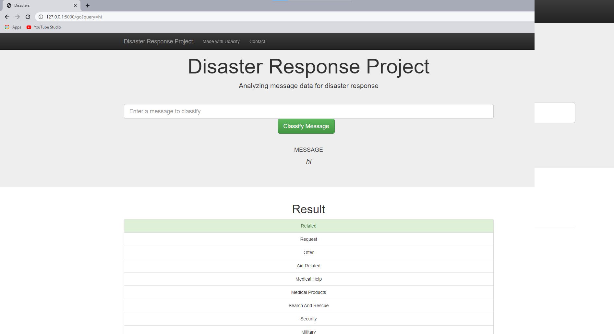

# Disaster Response Pipeline

## Description
In this project I will present a web app and related processing scripts where emergency workers can input a new message and get classification results in several categories. The web app will also display visualizations of the data. This project will show off my software skills, including my ability to create basic data pipelines and write clean, organized code!

This project is part of Data Science Nanodegree Program by Udacity in collaboration with Figure Eight. 

## Usage
### Dependencies
* json
* plotly
* pandas 
* nltk
* flask
* plotly
* sklearn
* joblib
* sqlalchemy

### Run
Please run the following commands in the project's directory to generate the database, train and save your model for the app.

    - To start the ETL pipeline, please run
        `python data/process_data.py data/disaster_messages.csv data/disaster_categories.csv data/disaster_response_db.db`
        
    - To start the ML pipeline, please run
        `python models/train_classifier.py data/disaster_response_db.db models/classifier.pkl`

2. Run the following command in the app's directory to run your web app that uses your generated model.
    `python run.py`

3. Go to http://127.0.0.1:5000 to start your app in the browser

## Screenshots
If you run the app correctly you should see the following messages in your terminal.

After pasting **http://127.0.0.1:5000** in your webbrowser you should see the following app.

You can enter new messages in the web app that should be classified.

